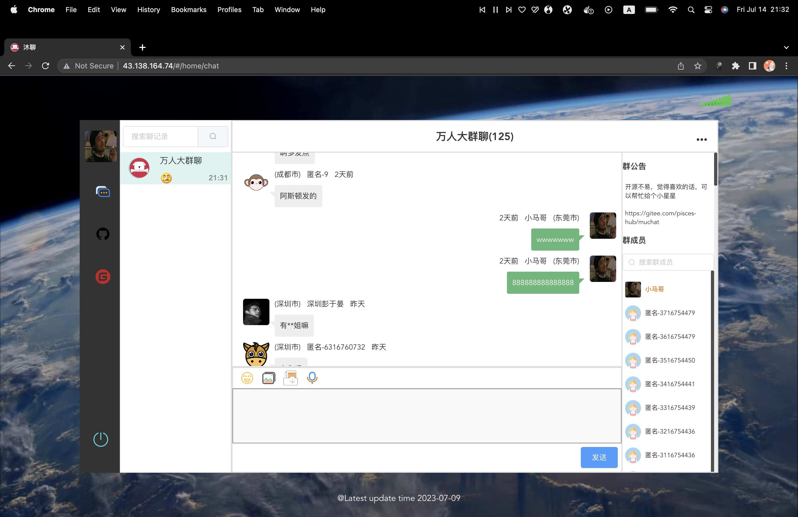
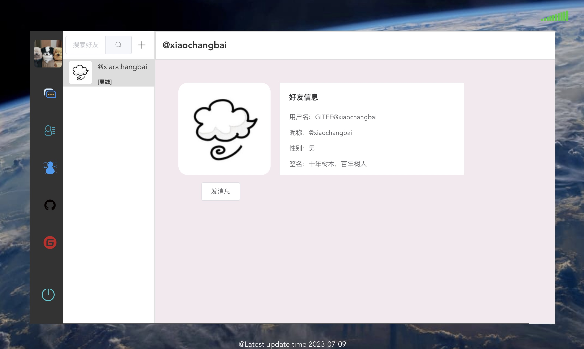

# MuChat


<br/>

> 1. **后端项目地址**：[muchat](https://gitee.com/pisces-hub/muchat)
> 2. **快速体验项目**：[在线访问地址](http://43.138.164.74)


## 前言

`Muchat`100w级即时通讯应用


## 项目介绍

`Muchat`的前端工程


#### 前端技术

| 技术       | 说明                  | 官网                                   |
| ---------- | --------------------- | -------------------------------------- |
| Vue        | 前端框架              | https://vuejs.org/                     |
| Vue-router | 路由框架              | https://router.vuejs.org/              |
| Vuex       | 全局状态管理框架      | https://vuex.vuejs.org/                |
| Element    | 前端UI框架            | https://element.eleme.io               |


### 搭建步骤

```shell
git clone https://gitee.com/pisces-hub/muchat-ui.git

cd muchat-ui

# Install dependencies
npm i

# Build packages
npm build

# Run the demo for development, it will automatically open the browser
npm run serve
```

### 项目运行截图





## Contributing

- For bug reports, please use [Issues](https://gitee.com/pisces-hub/muchat-ui/issues)
- For code contribution, please use [Pull Request](https://gitee.com/pisces-hub/muchat-ui/pulls).

## 联系方式


有任何问题，欢迎给我留言哦


## 点下star吧
喜欢的朋友麻烦点个star，鼓励一下作者吧！
## 许可证

[Apache License 2.0](https://github.com/pisces-hub/muchat/blob/develop/LICENSE)

Copyright (c) 2020-2023 muchat
